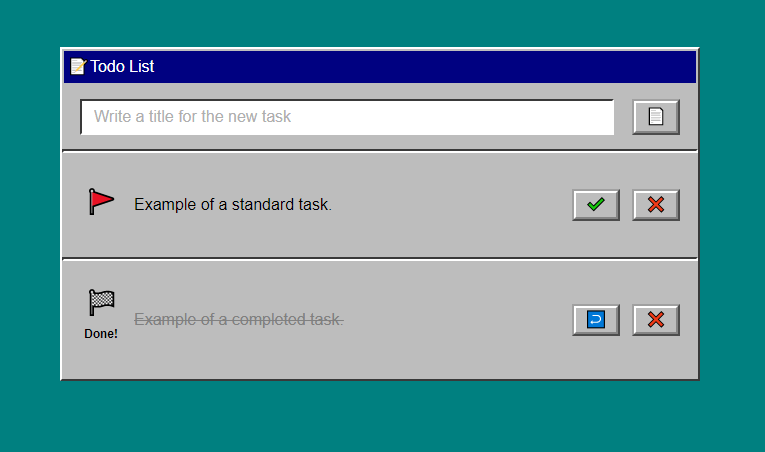
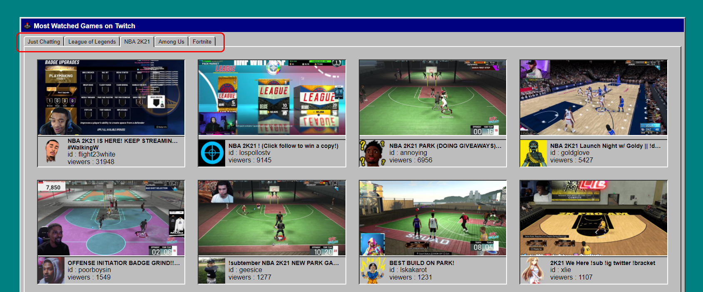

## 六到十週心得與解題心得

### Week 6

- 完全爆炸的一週，對 CSS 與 html 感到適應不良

- 為了趕上進度，即便心虛還是交了作業，最終表現不如預期，被助教指出不少改善空間

- 決定以後**即使進度落後**，也要**以弄懂內容為優先**

- 之後進行了不少 CSS `disply` 與 `position` 的相關練習

- 練習 [Flexbox Froggy](http://flexboxfroggy.com/) 以及 [CSS Diner](https://flukeout.github.io/),  直到解題變成直覺反應 ~~(現在可能還了一些回去~~

- 找到一個解析 [CSS Layout 的網站](https://zh-tw.learnlayout.com/toc.html)，內容簡單明瞭，花了一些時間跟著項目練習，進步有感

- 直到不再對 CSS 跟 html 感到排斥，想要的版型也能大致做個七成像，第六週告一段落，開始準備第七週的學習

---

### Week 7

- 開始逐漸上手的一週，首次在瀏覽器運行 js, 覺得有趣

- 只要跟上週有關的內容，一律打掉重練（~~看了頭痛~~

- 參考一個 [CSS Effects 網站](https://emilkowalski.github.io/css-effects-snippets/)，練習使用偽元素製作簡單的動態效果

- 在 [作業一](https://lidemy.github.io/mentor-program-4th-WooooHuan/homeworks/week7/hw1/) 做了一些嘗試

    - 練習使用 regex 進行字串內容處理，驗證輸入的正確性

    - 用 CSS 畫警告圖示（~~挺有趣的~~

    - 盡可能避免在 script 中，宣告網頁顯示用的文字內容，練習如何從 html 中獲取各種資訊

     
    
- 在 [作業二](https://lidemy.github.io/mentor-program-4th-WooooHuan/homeworks/week7/hw2/) 嘗試之前學到的 CSS 動態效果

    - 由於前期規劃不夠周全，又在做到一半時想要加動態，導致最後遇到不少預期外的狀況，深刻體驗到，開發途中變更規格所帶來的困擾

    - 其中一個預期外狀況是：行動平台沒有 :hover 可用，緊急加了 :active 應急，提醒自己日後設計時，要記得顧慮行動平台

    - 第一次體驗用文字格式描述動畫關鍵幀，挺有趣的～

    - 凡是跟「使用者互動」有關的元素，還是盡可能地用 transition, 避免使用 animation, 後者在互動時的「動態補間方面」的表現不是很好，要額外進行很多處理

     

- 在 [作業三](https://lidemy.github.io/mentor-program-4th-WooooHuan/homeworks/week7/hw3/) 嘗試將 CSS 進行更多發揮

    - ~~大部分的時間都在用 CSS 刻 windows 95 style 的介面~~

    - 為了讓按鈕的立體感盡量還原 win 95 的樣貌，用了偽元素來多畫一次 border

    - 開始留意各種解析度環境的 layout 適配以及空間不足時的縮放對策

    - 用 CSS 逐步完成構想好的畫面，這個過程特別好玩

    

    ▲ 這熟悉的配色與風格，~~小時候的快樂就是這麼樸實無華~~

     

- 在 [挑戰題](https://lidemy.github.io/mentor-program-4th-WooooHuan/homeworks/week7/ch1/) 嘗試了一些沒用過的 js 功能

    - 在交作業之際，看見挑戰題的需求好像沒有很難，就先隨便兜看看

    - 在有了雛型之後，開始著手重構，用了一個有點類似物件池的方式實現了這次的換頁功能

    - 為了實現自動捲動，嘗試了一些跟時間有關的 js 功能，感覺可以拿來做很多其它應用，先記在牆上

     

---

### Week 8

- 開始被上班時間壓迫到學習時間的一週，慶幸自己第四週的內容還沒忘光

- [作業一](https://lidemy.github.io/mentor-program-4th-WooooHuan/homeworks/week8/hw1/) 按圖施工，好像沒什麼特別的，順便練練切板，看能不能盡量接近設計圖

- [作業二](https://lidemy.github.io/mentor-program-4th-WooooHuan/homeworks/week8/hw2/) 佔去了本週大部分的時間

    - ~~win 95 介面我又來ㄌ~~

    - 為了實現 Win 95 的頁籤 UI, 花了不少心思

    - layout 適配在這次作業特別棘手，在 CSS 做了多組解析度適配方案

    - 挑戰功能：讀取更多實況，比想像中還麻煩一些，要顧及一些非同步的眉眉角角

    - 做作業的時候適逢 Summer Games Done Quick 2020 活動，出現許多觀看數足以登上前五、相關頻道卻未滿 20 個的極端案例

    - 臨時修補了 request 的次數上限，已排除極端案例導致的顯示錯誤，未來想到更好的解法再回來更新

    - ~~親身體驗到了極端案例無所不在，防不勝防~~

    

    ▲ 過程中最頭痛的頁籤效果

     

---

### Week 9

 - 按圖施工的一週，做起來特別無力，學習倦怠頻發

 - php 給人的感覺有點囉嗦，不是很喜歡使用 -> 符號下探屬性，以及變數前綴 $ 符的用法

 - 使用前端頁面跟後臺互丟資訊，大概是這週比較有趣的地方

 - 為了方便理解本週內容，有試著將留言版的實作邏輯做了一些整理，因篇幅稍長獨立成另一篇，詳見 [留言板筆記](./board.md)

 ---

 ### Week 10

- 顧慮到進度落後不少，本週只預計完成複習內容筆記，以及從兩個挑戰或 Show time 中挑選一個來實作

- 最後選擇了進行「異世界 r3 : 0 挑戰」，因篇幅稍長獨立成另一篇，詳見 [r30challenge.md](./r30challenge.md)
