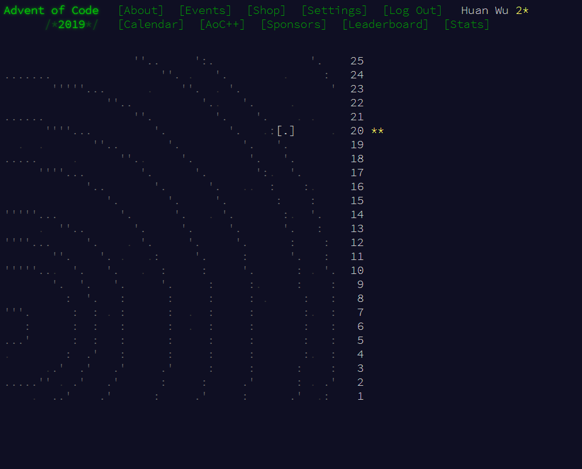
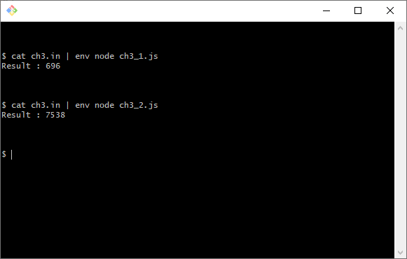

## hw1：好多星星

  - `for` + `repeat` 的基本運用

  - 大部分時間都在熟悉 LIOJ 系統該如何使用（~~常常玩壞~~

## hw2：水仙花數

  - 平鋪直敘的照題意寫出解法

  - 從 ESLint 學到了 `**` 的用法

  - 感覺還需要一點時間才能直覺地使用箭函式
  
  - 應該還有更好的解法，但看到答案被 `Accepted` 後就沒有去多想（~~懶~~

## hw3：判斷質數

  - ~~懶人餘除大法~~

  - 印象中有什麼根式排除法可以簡化，~~但看到答案被 `Accepted` ...~~

  - 在作業交了之後覺得良心不安，還是優化了搜尋範圍，將 `< n` 改為 `<= sqrt(n)`

  - [根式簡化的參考](https://www.youtube.com/watch?v=4vbcC4TcMGc)

## hw4：判斷迴文

  - 原本用 `slice` 花式分割字串，洋洋灑灑寫了三四五六行
  
  - 第五題做到一半才發現，迴文特性就是經過 `reverse` 後結果依然等於自身內容
  
  - ~~刪除了之前覺得還不錯、但實際上很多餘的內容~~
  
  - 提交被駁回後才發現，本題要求的答案規格是**首字大寫的字串型**（~~沒仔細看題目~~

## hw5：聯誼順序比大小

  - ~~又是因為沒看清楚規格，而踩到雷的題目~~

  - 首次作答時沒考慮到溢位問題

  - 感受到了 ternary operation 的威力

  - 答案被 `Accepted` 後才想到，上週大數乘法提到的 BigInt 這次沒被禁用

  - 聯誼時在卡片上寫了 500 多位數，只為了比大小，感覺會被討厭

## 挑戰題 : 走迷宮

  - 剛開始沒什麼想法時，依照提示去瞭解了一下相關內容

  - 看了一些[參考內容](https://zh.wikipedia.org/wiki/%E5%B9%BF%E5%BA%A6%E4%BC%98%E5%85%88%E6%90%9C%E7%B4%A2)後發現，還是自己想好了（~~因為看不懂~~

  - 想到這題目跟舊式 RPG 的地圖走法很像，試試看將走過的路徑進行劃記，劃記的區域不能再行走
  
  - 經過畫記操作，問題突然簡化許多，接下來只要考慮如何逐步放置 `agent`

  - 回頭再去看參考，發現已經可以瞭解一部分內容，但頭已經洗一半了，只能繼續解下去

  - 學會了一個與 `Queue` 相關的運用，最終得出了答案！

  - 本題最大的收穫應該是瞭解到：「不一定要想通題目再開始進行作答，在嘗試作答過程中，有可能就會想出一開始沒想到的答案」

  - ~~以後作答時會嘗試先寫了再說~~

## 超級挑戰題 : 貪婪的小偷

  - 挫折感滿重的一題，沒考慮過樣本數極高的狀況， LIOJ 跑到超時

  - 修改了取樣條件，將過重的案例排除，不列入計算

  - 經過一些修正後，在本地測試已能通過樣品數 30 的情況
  
  - 即使經過修正，仍然無法在 LIOJ 拿到 `Accepted`

  - 跟老師討論後，得到了取樣方式有待改進的提示，想了一下發現自己忽略了一些事情

  - 由於本題只求最終價值，沒有要列舉物品編號，所以如果已存在等重的案例，就捨棄較低價值的案例

  - 最終解法比之前要快上許多，記憶體消耗量也變得更低

  - 雖然感覺還有改善空間，但目前對這題的解法還挺滿意的，可以憑著直覺和人解釋為何如此作答

## 超級超級挑戰題 : Donut Maze Part 1

  - 經過了挑戰題的洗禮，很快就進入狀況，體質上都直接繼承前面的解法

  - 慶幸挑戰題沒有寫得雜亂無章還改得動

  - 為了解決最大問題「傳送」，先把傳送時的步驟列出來，想了一下需要的功能

    - 必須要知道下個座標撞到的是誰 → 需要擴充判斷座標內容的功能，是路還是字母？

    - 撞到英文字，搜尋相鄰的另一個英文字 → 我需要一個搜尋相鄰字符的函式

    - 獲取入口的資訊後，需要一個以入口資訊去搜尋出口的座標的功能

    - 陸續新增了「輸入座標，輸出字符」、「輸入座標跟字符、複寫地圖」等等的函式

    - 最後發現自己寫了太多沒什麼用的函式，開始進行收斂修剪

    - 確保輸入輸出是正確且穩定的時候，就不用再考慮內部是如何實現的，減少很多解題時的負擔
  
  - 功能函式完成後，開始驗證自己的假設，感覺要整理出解法只是耐心問題

  - 經過一段時間後，理解到了人的耐心有限，尤其是某些地方錯得亂七八糟時

  - 學會了使用斷點工具來除錯

  - 歷經一番修正，[通過了小規模測試！](https://www.youtube.com/watch?v=D8jFAUpOl8c)

  - 將輸入改為網站提供的內容，得出了一個挺大的數字，當下有點緊張是不是砸了
  
  - 把答案拿去網站輸入，得到了第二關的門票，鬆了一口氣，成功獲得一顆星星！

  - 從這題開始充分感受到了 ESLint 的龜毛程度

## 超級超級挑戰題 : Donut Maze Part 2

>兩題都完成後獲得的星星！

- 經過了前一題的洗禮，看了題目描述後想直接放棄

- 由於前一題解法的修改彈性有限，要用在第二題有許多地方需要進行修改

- 了解到自己沒辦法頂著耐性，依照第二題的規格整個重寫，於是走上修改跟擴充現有函式的不歸路

- 硬著頭皮把迷宮升成三維，取出迷宮座標時要使用 [z, y, x] 方式取值

- 由於不想重寫部分邏輯，進行計算時，要以 [y, x, z] 來進行計算（~~笑死~~

- 跟上一題的不同之處除了維度以外，還有神奇的傳送規則

- 為了讓上一題的功能可以運行，開始對函式進行修正

  - 新增拔除第一層迷宮外圍出口的函式

  - 創建新迷宮時會自動拔除 AA 跟 ZZ 出口

  - 進行傳送跳躍時，要依照入口所在座標，回傳不同維度的出口座標

- 過程中還是犯了不少錯誤，斷點工具越來越熟練了

- 最終看到跑出結果而不是錯誤訊息還滿令人感動的

- 將答案提交後順利地拿到了第二顆星星！

- 有很多地方可以寫得更好，內外層判斷不該寫死，也無法應付 AB, BA 這種「同符異序」的跳躍點同時存在的場合

- 過程中其實很多次都想擺爛去做其它事情，不過最終還是堅持下來，覺得自己的抗壓能力進步了！
