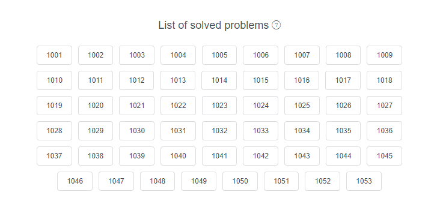

## 前四週心得與解題心得

### Week 1 
---
  - 熟悉了自己一直以來想要瞭解、又沒什麼動力去學習的 Command Line 

  - 平時作業環境是 Windows 10 系統，在平台指令差異方面吃了一點苦頭

  - 在熟練之後，某些指令還是挺方便的，目前 npm 的相關操作就很仰賴 Command Line 的使用
  
  - 不再那麼抗拒純文字的使用者介面了
  
    

### Week 2
  ---
  - 熟悉了 JavaScript 的基本語法
 
  - 起初對 JS 語法的弱型別以及高度自由的特性，感到有些無所適從
 
  - 憑著剛加入計畫的三分鐘熱誠，為了盡量將作業寫好，查了不少語法相關的知識，上班可能都沒這麼認真
 
  - 詳細的為每一則作業寫上了註解，但發現不只對自己的學習幫助有限，還很花時間，往後作業就沒延續這個習慣
 
  - 第一次在作業拿到值得參考推薦，覺得自己的學習有受到肯定，感受到正能量的鼓舞！
 
  - 當時還在擔心，日後會不會為了拿值得參考而走火入魔，本末倒置，在作業花上太多心力跟時間
  
  - 事後證明擔心是多餘的，自己的惰性還是比較強的，沒興趣的東西總是放棄得特別快
  
    

### Week 3
  ---
  - 最大的衝擊莫過於 eslint 的引入，在執行挑戰題上傳時，充分感受到了它帶來的影響（勞心費神的那面
  
  - 在挑戰題學會了斷點工具的使用，在日後提供了很多幫助

  - 解題的相關心得，詳見：[Week3.md](Week3.md)

    

### Week 4
  ---

  - 對自己來說算是學得沒這麼順利的一週，在 API 的引用踢到許多鐵板，例如：

    - 請求時設定 limit = 100 , 傳回來的資訊卻不足 100

    - 設定 offset 偶爾會失靈

    - 由於回傳延遲的關係，有很多做法不能效仿之前的經驗

  - 很多時後腳本可以運作，但無法解釋為何 (笑死

  - 對如何設定 request 參數這點沒什麼把握

  - 以上情況在完成了第五週的 http challenge 之後才改善許多

  - 或許可以將 http challenge 納入正式作業，補充一些需要的知識內容，把學習時間放寬至兩週

### Week 5
  ---

  - 複習週，主要進行兩件事：還 LIOJ 的債，完成 http challenge

  - 第四週覺得學習不太踏實的部分，在完成 http challenge 有明顯的改善

  - 由於 http challenge 的解題心得篇幅過長，詳見：[LidemyHttpChallenge.md](LidemyHttpChallenge.md)

    
  
  - 終於把 LIOJ 的題目解完，覺得自己又進步了一些。雖然比想像中還費時，但很有成就感！練習結果收錄於本週的 LIOJ 目錄中

  - 在經過題目洗禮之後，覺得自己在解讀需求方面的能力有一些進步

  - 過程中還是會因為自己的粗心而卡關，例如變數或回傳結果的大小寫打錯之類的

  - 覺得 LIOJ 的題目排序依據很神秘

  - 看了第五週的 Show Time 內容後，想要製作一個：針對美術設定網站，可以指定作者，自動獲取該作者的公開作品的功能腳本

  - 著手進行後發現還有很長的路要走（笑
