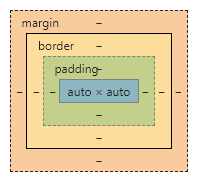

## 請找出三個課程裡面沒提到的 HTML 標籤並一一說明作用。

### 截至第六週為止沒提到的標籤：

| 項目 | 描述 |
| ---- | ---- |
| < script > | 用於定義腳本元素，語言為 JavaScript |
| < noscript > | 當瀏覽器不支援腳本時顯示的替代文字 |
| < template > | h5 限定，定義一個 JavaScript 運行時所實例化內容的容器 |

> [Reference : MDN](https://developer.mozilla.org/zh-CN/docs/Web/Guide/HTML/HTML5/HTML5_element_list)

---

## 請問什麼是盒模型（box model）

盒模型為網頁最基本的區塊元素單位

---

## 請問 display: inline, block 跟 inline-block 的差別是什麼？

| 項目 | 描述 |
| ---- | ---- |
| inline | 行內元素，為 < a >, < span > 等 html 標籤的預設顯示模式，元素將順應所在橫行的排版流 |
| block | 塊元素，為 < p >, < div > 等 html 標籤的預設顯示模式，以換行的形式獨立於相鄰的元素，預設寬度為最大可行寬度 |
| inline-block | 綜合以上元素特性的元素，對其他元素展現 inline 特性、對內部元素採用 block 特性 |

> [Reference : MDN](https://developer.mozilla.org/en-US/docs/Web/CSS/display)

---

## 請問 position: static, relative, absolute 跟 fixed 的差別是什麼？

| 項目 | 描述 |
| ---- | ---- |
| static | 不跳脫排版流，不以特殊位置來排列的預設狀態 |
| relative | 不跳脫排版流，以原本的位置作為依據進行定位 |
| absolute | 跳脫排版流，以特定元素最為依據進行定位 |
| fixed | 跳脫排版流，以視窗位置作為依據進行定位 |

> [Reference : Lidemy - Position 實戰篇](https://lidemy.com/courses/932146/lectures/22768679)
